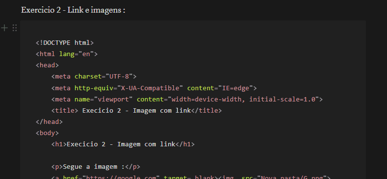

# Projeto com README
Um projeto de teste com um arquivo README 👌


[ ]


# tecnologias utilizadas :
- HTML
- CSS
- JS


# Como utilizar :

1 - Clone o projeto
```
  git clone
  ```

---

2 - Acesse a pasta do projeto
```
cd...repositorio-com-readme
```

